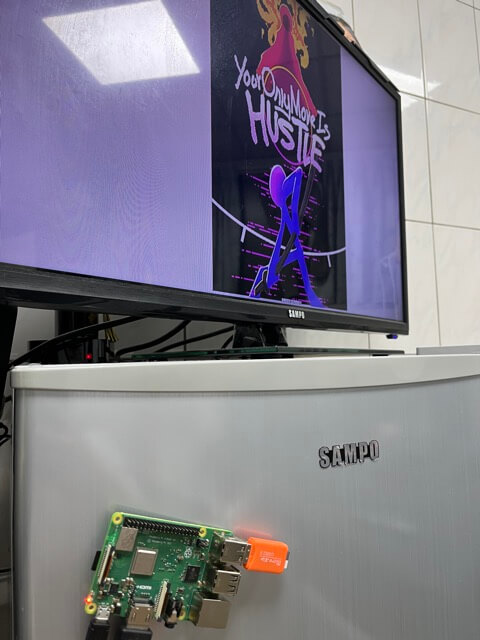

# ePhotoPlayer (The Simplest Photo Album for Grandma)

**ePhotoPlayer** is a simple app designed for older people to enjoy their photos on a TV or any HDMI device. This project runs on Raspberry Pi.
- This is made for my grandma.

## Features
- Automatically plays photos from the `photos/` folder (supported formats: jpeg, jpg, png).
- Plays music from the `music/` folder (supported format: mp3).
- Easy to use with a plug-and-play USB device.
- Software will auto start with Raspberry Pi boot.
- If software crashes, it will automatically re-open.

## Demo
<video width="640" controls>
  <source src="./demo-resource/MV_01.mp4" type="video/mp4">
  Your browser does not support the video tag.
</video>
<div style="display: flex; align-items: flex-start;">
  
  
</div>


## How to Use
1. Connect the Raspberry Pi to your HDMI device.
2. Plug a USB device into the Raspberry Pi. The USB device must contain the following folders:
   - `photos/`
   - `music/`
3. Enjoy! ePhotoPlayer will automatically play photos and music from the respective folders.

## Installation

### Device Requirement
- Raspberry Pi (example used: Raspberry Pi 3B)
- OS (example used: MacOS)
- docker

### Steps

#### 1. Build the Docker Image for Raspberry Pi
```bash
$ make build-image-raspberry
```


#### 2. Compile the Executable for Raspberry Pi
```bash
$ make build-raspberry
```

#### 3. Flash Your Raspberry Pi with the GUI
(Example used: RASPBERRY PI OS 32-bit)
- Enable SSH and allow account/password login.
- Remember your `username`.

#### 4. Copy the Auto-Execute Shell and Executable to Raspberry Pi
(Note: Replace `nimo` with your actual `username`. In this case, `nimo` is an example.)
```bash
$ scp -vvv ./fyne-cross/bin/linux-arm/ePhotoPlayer ./autoplay/* nimo@raspberrypi.local:/home/nimo
$ ssh nimo@raspberrypi.local
$ chmod +x setup_auto_restart.sh  # On the Raspberry Pi
$ sudo ./setup_auto_restart.sh      # On the Raspberry Pi
```

# Enjoy!
Once the setup is complete, sit back and enjoy your photos and music on your HDMI device.

# License
This project is licensed under the MIT License.
